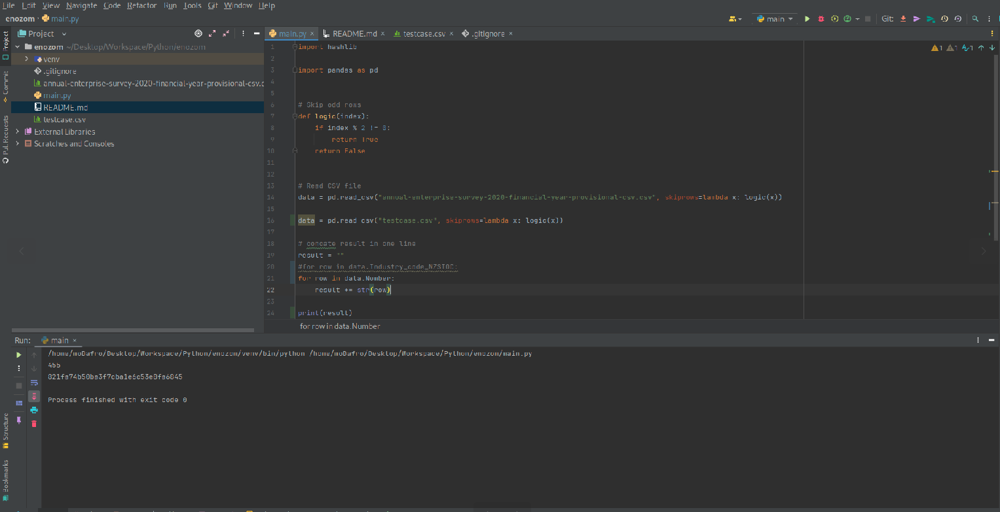

# csv_demo

csv_demo read csv file and skip the odd rows then print the third column in one line string after hasing it with md5

## Table of contents

- [Overview](#overview)
    - [Screenshot](#screenshot)
- [My process](#my-process)
    - [Built with](#built-with)
- [Author](#authors)

## Overview

### GIF



## My process

1) Clone the project

   ``` https://github.com/MohamedEldefrawy/csv_demo.git```
2) install [padnas](https://pandas.pydata.org/docs/getting_started/install.html)

### Built with

* [Python](https://www.python.org/)
* [pandas](https://pandas.pydata.org/docs/getting_started/install.html)

## Authors

* LinkedIn - [Mohamed Eldefrawy](https://www.linkedin.com/in/mohamedeldefrawy)

<p align="right">(<a href="#top">back to top</a>)</p>
